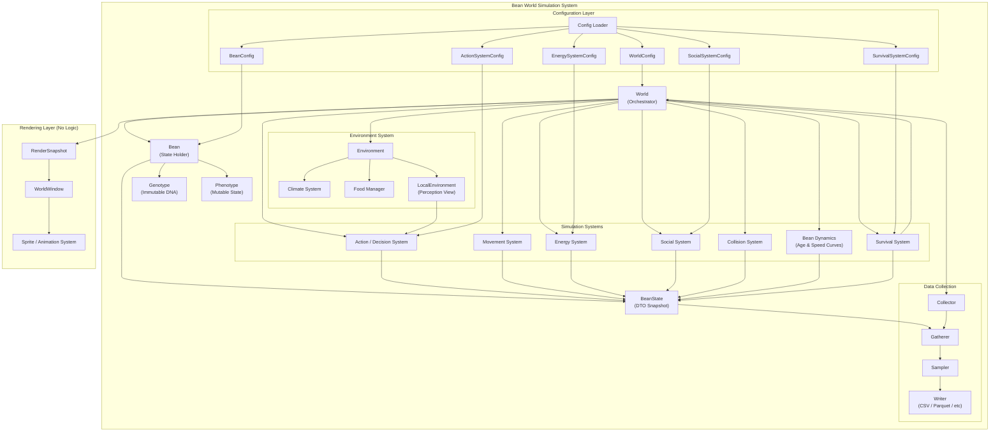

```mermaid
flowchart TB
  %% =========================
  %% SYSTEM BOUNDARY
  %% =========================
  subgraph SYSTEM["Bean World Simulation System"]
    direction TB

    %% =========================
    %% WORLD
    %% =========================
    World["World\n(Orchestrator)"]

    %% =========================
    %% CORE STATE
    %% =========================
    Bean["Bean\n(State Holder)"]
    Genotype["Genotype\n(Immutable DNA)"]
    Phenotype["Phenotype\n(Mutable State)"]
    BeanState["BeanState\n(DTO Snapshot)"]

    %% =========================
    %% ENVIRONMENT
    %% =========================
    subgraph ENV["Environment System"]
      Environment["Environment"]
      Climate["Climate System"]
      FoodManager["Food Manager"]
      LocalEnv["LocalEnvironment\n(Perception View)"]
    end

    %% =========================
    %% CORE SYSTEMS
    %% =========================
    subgraph SYSTEMS["Simulation Systems"]
      EnergySystem["Energy System"]
      MovementSystem["Movement System"]
      ActionSystem["Action / Decision System"]
      SocialSystem["Social System"]
      CollisionSystem["Collision System"]
      SurvivalSystem["Survival System"]
      BeanDynamics["Bean Dynamics\n(Age & Speed Curves)"]
    end

    %% =========================
    %% DATA COLLECTION
    %% =========================
    subgraph DATA["Data Collection"]
      Collector["Collector"]
      Gatherer["Gatherer"]
      Sampler["Sampler"]
      Writer["Writer\n(CSV / Parquet / etc)"]
    end

    %% =========================
    %% CONFIGURATION
    %% =========================
    subgraph CONFIG["Configuration Layer"]
      ConfigLoader["Config Loader"]
      WorldConfig["WorldConfig"]
      BeanConfig["BeanConfig"]
      EnergyConfig["EnergySystemConfig"]
      SocialConfig["SocialSystemConfig"]
      ActionConfig["ActionSystemConfig"]
      SurvivalConfig["SurvivalSystemConfig"]
    end
  end

  %% =========================
  %% RENDERING BOUNDARY
  %% =========================
  subgraph RENDER["Rendering Layer (No Logic)"]
    WorldWindow["WorldWindow"]
    SpriteSystem["Sprite / Animation System"]
    RenderSnapshot["RenderSnapshot"]
  end

  %% =========================
  %% RELATIONSHIPS
  %% =========================

  %% World orchestration
  World --> Bean
  World --> Environment
  World --> EnergySystem
  World --> ActionSystem
  World --> MovementSystem
  World --> SocialSystem
  World --> CollisionSystem
  World --> SurvivalSystem
  World --> BeanDynamics
  World --> Collector

  %% Bean internal structure
  Bean --> Genotype
  Bean --> Phenotype
  Bean --> BeanState

  %% Environment
  Environment --> Climate
  Environment --> FoodManager
  Environment --> LocalEnv

  %% Perception
  LocalEnv --> ActionSystem

  %% Systems read/write BeanState
  ActionSystem --> BeanState
  MovementSystem --> BeanState
  EnergySystem --> BeanState
  SocialSystem --> BeanState
  CollisionSystem --> BeanState
  BeanDynamics --> BeanState

  %% Survival
  SurvivalSystem --> BeanState
  SurvivalSystem --> World

  %% Data collection flow
  BeanState --> Gatherer
  Gatherer --> Sampler
  Sampler --> Writer
  Collector --> Gatherer

  %% Config wiring
  ConfigLoader --> WorldConfig
  ConfigLoader --> BeanConfig
  ConfigLoader --> EnergyConfig
  ConfigLoader --> SocialConfig
  ConfigLoader --> ActionConfig
  ConfigLoader --> SurvivalConfig

  WorldConfig --> World
  BeanConfig --> Bean
  EnergyConfig --> EnergySystem
  SocialConfig --> SocialSystem
  ActionConfig --> ActionSystem
  SurvivalConfig --> SurvivalSystem

  %% Rendering bridge
  World --> RenderSnapshot
  RenderSnapshot --> WorldWindow
  WorldWindow --> SpriteSystem
```
